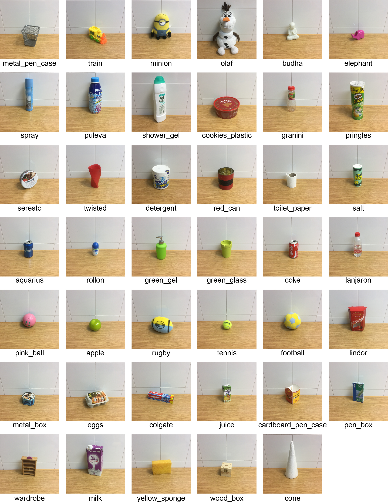
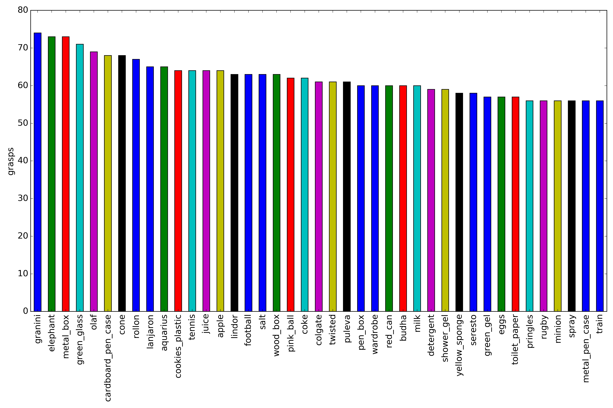

# BioTacSP Stability Set (BTS3)

We have performed grasps using a Shadow Dexterous hand equipped with three BioTac SP tactile sensors in its index finger (ff), middle finger (mf) and thumb (th). The dataset stores 24 values for each of the tactile sensors, the grasped object and whether the object slipped or not from the hand. Two orientations have been considered: (1) the palm of tha hand point downwards and (2) the palm pointing to the side (thumb upwards). Pictures below show one example for each orientation.


The dataset is split in two files, one for each orientation. See the next table for a summary of them:

| Dataset   | Stable Grasps | Sliding Grasps |
|:---|:---:|:---:|
| Palm Down |      667      |       609      |
| Palm Side |      603      |       670      |
| Whole     |      1270     |      1279      |

In total, we have used 41 objects for recording these datasets:





# Citation
```
@INPROCEEDINGS{BTS3,
  author = {Zapata-impata, Brayan S. and Gil, Pablo and Torres, Fernando},
  journal = {IEEE/RSJ IROS 2018 Workshop RoboTac: New Progress in Tactile Perception and Learning in Robotics},
  title = {{Non-Matrix Tactile Sensors: How Can Be Exploited Their Local Connectivity For Predicting Grasp Stability?}},
  url = {https://arxiv.org/abs/1809.05551},
  booktitle = {eprint arXiv:1809.05551},
  year = {2018}
}
